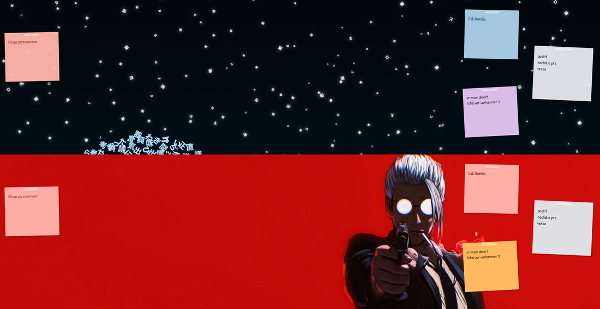

# Noctes - Stickers for Noctalia

**Noctes puts sticky notes on your desktop.** Not in a window, not in a list -
on the wallpaper itself, below every window, where you already look. Each note
is its own desktop widget: a sheet of paper at a small random angle, a strip of
tape on top, written in a handwriting font, in a colour the shell chooses.


## The paper follows the wallpaper

A note with no colour of its own draws from Noctalia's palette, and on a
generated theme that palette comes from the wallpaper. Change the wallpaper and
the whole wall recolours itself - same notes, same settings, one wallpaper
apart:



Want a sheet to stop moving? Pick a chip and it is fixed for good. Eight papers,
plus two that are not paper: **black**, the one sheet written in white ink, and
**glass**, a translucent pane whose text flips with the scheme.

## Writing on them

Clicking a sheet opens the panel on that note. That is the whole interface -
there is no note list, because the notes are already on screen.

| | |
| --- | --- |
|  | Title, body, colour. **+** creates the next sticker - note and sheet together, already tilted. The arrows hand the desk back to the widget editor for dragging and resizing. The gear opens the plugin settings. The bin deletes note and sheet as one. |

## In short

- One sheet per note. Size, font size, tilt, tape, opacity and colour are per
  sheet; defaults, theme following and storage path are plugin-wide.
- Notes live in one plain JSON file. No database, no sync, no account - delete
  the plugin and your notes are still readable on disk.
- A bar widget with the note count, which opens the panel.
- IPC, so a quick note can be one keybind away.

## Install

```sh
git clone https://github.com/RamonRemo/noctes.git ~/noctes
noctalia msg plugins source add noctes path ~/noctes
noctalia msg plugins enable remo/noctes
```

A plugin cannot place a desktop widget on its own, so the first sheet comes from
**Settings -> Desktop -> Widgets -> Toggle Editor**: add a *Noctes* widget and
press Done. It arrives square and grey in a dark frame; a second later the
service tilts it, colours it and drops the frame. Click it and write.

Every sheet after that comes from the panel's **+**, or from a terminal:

```sh
noctalia msg plugin remo/noctes:service all desk
```

## IPC

```sh
noctalia msg plugin remo/noctes:service all desk           # note + sheet
noctalia msg plugin remo/noctes:service all new "buy milk" # note only
noctalia msg plugin remo/noctes:service all open work      # select a note by key
noctalia msg plugin remo/noctes:service all move           # toggle the widget editor
noctalia msg plugin remo/noctes:service all reload         # re-read notes.json
```

`desk` and `new` both select what they create, so pairing either with
`noctalia msg panel-open remo/noctes:panel` makes a one-keybind quick note.

## Read more

- [`noctes/README.md`](noctes/README.md) - every setting, in tables, and how the
  four entries fit together.
- [`docs/plugin-notes.md`](docs/plugin-notes.md) - what it took to make paper
  look like paper inside a plugin sandbox, and the dozen things about Noctalia's
  plugin API that are documented nowhere and cost an afternoon each. Writing a
  Noctalia plugin? Start there.

## License

MIT. The bundled Patrick Hand font is SIL OFL 1.1 - it is the handwriting the
notes are written in.
