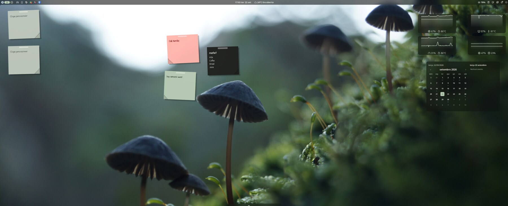
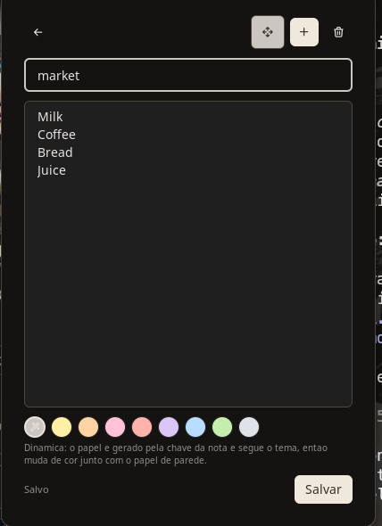

# noctes - stickers for noctalia

You know the notes. The ones on the fridge, on the edge of a monitor, stuck to a
book at the page you meant to come back to. You never *open* them. They are
simply there, in the corner of your eye, until the thing is done and the paper
comes off.

Software forgot how to do that. Notes went into apps: a window to raise, a list
to scroll, a sidebar of folders, a sync indicator. Everything a sticky note is
not. A sticky note has no inbox. It does not have seventeen of anything. It is a
square of colored paper with four words on it, stuck somewhere you will look
anyway.

That is what this is. Little sheets of paper stuck to your desktop, slightly
crooked, a strip of tape on top, written in a hand that is not your system font.
They sit above the wallpaper and below every window, so they are not in the way -
they are just *there*, waiting for the moment you clear the screen and see them
again.

And because they live inside noctalia, they take its colors. Change the
wallpaper, and the whole wall of notes changes with it. One minute a cluster of
dusty greens, the next a pink one next to a near-black one, matching the picture
behind them. You do not configure that. It just keeps happening, and it is a
small delight every time.



## What it is, plainly

A plugin for [Noctalia](https://noctalia.dev), the Wayland shell. It adds:

- **stickers on the desktop** - one note per sheet, in a color the shell picks,
  tilted a couple of degrees so a wall of them never looks like a spreadsheet
- **a small panel** to write in, which opens when you click a sheet
- **a bar widget** with the count, in case you like knowing

Notes are plain text in a plain JSON file. Nothing syncs anywhere. Nothing
phones home. Delete the plugin and your notes are still sitting in a file you
can read.

## Getting your first sticker up

This is the one fiddly part, and it only happens once.

A plugin cannot conjure a desktop widget out of nothing - noctalia's own editor
has to place the first one. So:

1. Open **Settings → Desktop → Widgets → Toggle Editor**.
2. Pick **Noctes** from the type list and add one.
3. Press **Done**.

It appears plain at first: square, straight, sitting in a dark panel. Give it a
second. Closing the editor is the cue for a small watcher to step in, tilt the
sheet, give it a color and take the panel away.

From then on the editor is done with. **Click the sheet.** Everything else lives
in the panel that opens:

| Writing in a note | |
| --- | --- |
|  | Type a title, type a body, pick a color. **+** makes another sticker - note and sheet together, already tilted and colored. The arrows hand the desk back to noctalia's widget editor so you can drag things around. The bin takes the note and its sheet off the wall together. |

If you would rather skip the editor entirely on the first run, one command does
the same thing:

```sh
noctalia msg plugin remo/noctes:service all desk
```

## Installing it

```sh
git clone https://github.com/RamonRemo/noctes ~/Projetos/noctes
noctalia msg plugins source add noctes path ~/Projetos/noctes
noctalia msg plugins enable remo/noctes
```

Then the watcher that tidies up sheets added through the widget editor:

```sh
ln -s ~/Projetos/noctes/tools/systemd/noctes-scatter.{service,path} ~/.config/systemd/user/
systemctl --user daemon-reload
systemctl --user enable --now noctes-scatter.path
```

It is optional. Without it, a sheet you add through the editor stays straight
and grey until you run `tools/noctes-scatter` by hand - everything made from the
panel is fine either way.

## About the colors

Every note is **dynamic** unless you say otherwise: it picks its own paper, and
follows the shell's palette, which on a generated theme follows your wallpaper.
That is the default and it is the fun one.

If a note earns a fixed color - the red one is always the red one - pick a paper
from the row of chips and it stops following anything. Groceries stay yellow
forever if that is what you want.

The chips in the editor always show what the sheet will actually look like, and
a line under them says which mode the note is in, so nothing is a surprise.

## Things that are the way they are

A few decisions worth knowing, since they will come up:

**You write in the panel, not on the sheet.** The sheets are painted below your
windows, where nothing can take the keyboard. That is a rule of the surface they
live on, not a choice. Clicking a sheet opens the panel on that note, which is
one click either way.

**There is no list of notes.** There was, briefly, and it was silly: the notes
are already on screen. Picking one means looking at the wall and clicking the
one you want.

**No folded corners.** They were there, they looked like a printing error, and
they are off. The short version is that the drawing tools available to a plugin
cannot make a clean diagonal. The long version is in the notes below.

**Deleting takes the sheet with it.** A note and its sticker are the same thing.

## Settings

Per note, in the widget's own settings: paper size, font size, lines shown,
color, tape, opacity, whether the title shows, whether it follows the theme.

Plugin-wide, in noctalia's plugin settings: default color, paper opacity,
whether the wall follows the theme, and where `notes.json` lives.

The full tables are in [`noctes/README.md`](noctes/README.md), along with the
IPC commands if you want a keybind for "new note right now".

## For the curious

[`docs/plugin-notes.md`](docs/plugin-notes.md) is the other kind of document:
what it took to make paper look like paper inside a plugin sandbox, and the
eight or nine things about noctalia's plugin API that are not written down
anywhere and cost an afternoon each. Drop shadows that paint nothing, palette
roles that do not exist, sliders with two positions. If you are writing a
noctalia plugin of your own, start there - it will save you the afternoons.

## License

MIT. The bundled Patrick Hand font is under the SIL Open Font License 1.1, in
`noctes/PatrickHand-OFL.txt` - it is the handwriting the notes are written in,
and it deserves the credit.
