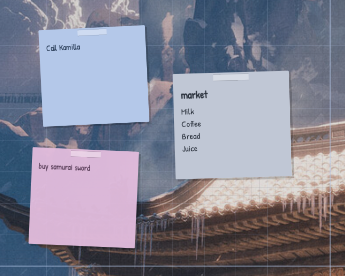
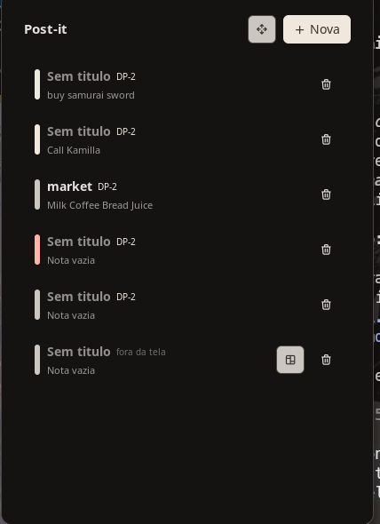

# noctes

A Noctalia plugin source holding one plugin: **`noctes/noctes`**, sticky notes
that live on the desktop rather than in a panel.



The plugin's own documentation - what it does, every setting, the IPC commands -
is [`noctes/README.md`](noctes/README.md). This file covers the repository: how
to run it, how it is laid out, and the handful of host facts that shaped it.

## Running it

This directory is a plugin *source*, the same shape Noctalia's own plugin repos
have: a hand-written `catalog.toml` at the root and one directory per plugin.

```sh
noctalia msg plugins source add noctes path ~/Projetos/noctes
noctalia msg plugins enable noctes/noctes
```

## Getting the first one up

A plugin cannot create a desktop widget from nothing, so the very first sheet
comes from Noctalia's own editor:

1. **Settings -> Desktop -> Widgets -> Toggle Editor**, pick **Noctes** from
   the type list, add one, then press **Done**. It appears plain: square,
   untilted, sitting in a dark panel.
2. A second later it is not. Leaving the editor writes `settings.toml`, the
   watcher in `tools/systemd/` notices, and `noctes-scatter` gives that sheet a
   random tilt, a key of its own, and no background.
3. Click it. The panel opens on that note, and **everything else happens from
   there**: *New* adds the next post-it - note and widget together, already
   tilted and colored - the move button reopens the widget editor to drag and
   resize, and the bin deletes the note and takes its sheet off the desktop.

So the editor is a one-time errand. After the first sheet, the panel is the
whole interface.

| The panel | Editing a note |
| --- | --- |
|  |  |

Straight to a post-it without touching the editor at all, if you prefer:

```sh
noctalia msg plugin noctes/noctes:service all desk
```

`.luau` edits hot-reload. Manifest edits need `noctalia msg config-reload`, and
in practice a full `disable` + `enable` (see *Hot reload is partial* below).
`noctalia plugins lint noctes` validates the manifest against the code offline.

## Layout

```
catalog.toml                 index of this source, hand-maintained (CI writes it upstream)
noctalia.d.luau              plugin API type definitions, gitignored; fetch from official-plugins
tools/
  noctes-scatter             tilt/key/unbackground post-its added through the widget editor
  systemd/                   path unit that runs the above when settings.toml changes
noctes/
  plugin.toml                manifest: entries and settings
  service.luau               owns the note list and the notes.json file
  note.luau                  [[desktop_widget]] - one post-it per instance
  panel.luau                 [[panel]] - the only surface that takes the keyboard
  bar.luau                   [[widget]] - count, opens the panel
  colors.luau                paper colors, palette roles, the seeded look
  tools/noctes-widget        adds and removes desktop widgets in settings.toml
  translations/              en, pt-BR
  PatrickHand-Regular.ttf    bundled handwriting font (SIL OFL)
```

## Host facts worth knowing

Things about Noctalia 5 that cost time to discover, and that the code is shaped
around. They are documented where they bite, in the file that has to live with
them; collected here because they are not guessable.

**A desktop widget has no identity.** The `desktopWidget` API is `render`,
`setWantsSecondTicks` and `setNeedsFrameTick` - no instance id, no output name.
Two sheets run the same code with nothing to tell themselves apart, so the only
thing that can bind one widget to one note is a setting. That is what the `key`
setting is, and why it exists at all.

**Three fields a plugin cannot reach.** A desktop widget's `rotation`, its host
background panel, and the widget entry itself are all host state in
`settings.toml`. Nothing in the plugin API writes them, so `tools/noctes-widget`
and `tools/noctes-scatter` edit that file, back it up, run
`noctalia config validate`, and restore on failure. An unknown key inside a
widget's settings table does not fail gracefully: it breaks the parse and takes
down the whole shell - bar, dock, wallpaper - until the file is fixed. Validate
before reloading, always.

**`rotation` is radians**, not degrees. `0.05` is about three degrees.

**A plugin widget is centered at its natural size** inside the widget box, so it
carries its own size; `flexGrow` does not stretch it to the box.

**`ui.box` needs both a width and a height** or it paints nothing at all, with
no warning. That one hid the drop shadow for several versions. `softness` on a
box feathers its edge, which is what makes a hand-drawn shadow read as a shadow
instead of a printed stripe.

**The palette is fourteen roles**, the ones in Noctalia's theme files:
`primary`, `on_primary`, `secondary`, `tertiary`, `error`, `surface`,
`on_surface`, `surface_variant`, `on_surface_variant`, `outline`, `shadow` and
friends. The Material *container* roles do not exist here, and naming one paints
transparent - again silently. Hex takes its alpha as `#rrggbbaa`; only role
names take the `role/0.6` form.

**This build caps below plugin API 32.** A manifest declaring 32 is marked
`incompatible` and disabled, so `tooltip` on a box or flex container - API 32 -
is out of reach. Only `ui.button` has a tooltip.

**Hot reload is partial.** Editing a `.luau` does not reliably reach every
desktop widget already on screen: two sheets can end up on the new code and two
on the old, with no error anywhere. After a code change:

```sh
noctalia msg plugins disable noctes/noctes && noctalia msg plugins enable noctes/noctes
```

Toggling a plugin *setting* is different - that repaints everything at once, and
is the reliable path.

**The widget editor holds new widgets in memory** until it closes. A widget
added there is not in `settings.toml`, and nothing that reads the file can see
it, until Done is pressed.

## Editor setup

`noctalia.d.luau` declares the whole plugin API. It is gitignored; fetch it into
the repo root, where `.luaurc` and luau-lsp expect it:

```sh
curl -O https://raw.githubusercontent.com/noctalia-dev/official-plugins/main/noctalia.d.luau
```

## License

MIT, except the bundled Patrick Hand font, which is under the SIL Open Font
License 1.1 (`noctes/PatrickHand-OFL.txt`).
